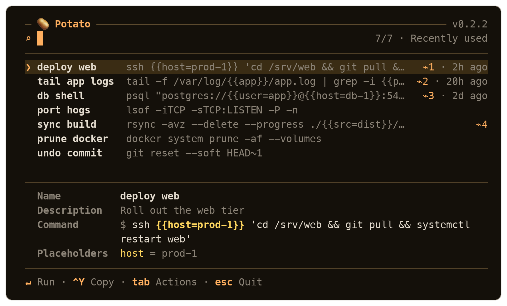
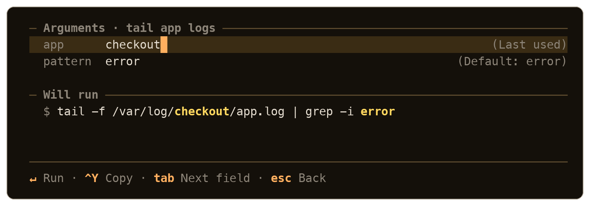

# 🥔 Potato

Potato keeps the long terminal commands you can never remember, finds them by fuzzy search, and hands them back. It never runs anything itself. Enter drops the finished command at your shell prompt so you can read it before you commit to it, and Ctrl-Y puts it on your clipboard instead.



## Install

```sh
curl -fsSL https://raw.githubusercontent.com/luojiahai/potato/main/install.sh | bash && source ~/.potato/init.sh
```

macOS and Linux on x64 or arm64, with zsh and bash. There is no sudo and no PATH edit: everything lands under `~/.potato`, and the installer adds one line to your shell rc. To pin a release instead of taking the latest, append `-s -- 1.0.0` to the `bash`.

## Use

Run `potato`. Type to narrow the list, then press Enter. The command arrives pre-filled at your prompt, where a second Enter runs it. Nothing executes until you say so.

Ctrl-Y copies rather than hands off. It writes through a system clipboard tool when there is one and always emits OSC 52 as well, so it still works over SSH and inside tmux. Tmux needs `set -s set-clipboard on` in `~/.tmux.conf` to pass it through.

Search is a fuzzy subsequence match across each command's name, description, and text, with name matches ranked highest. An empty query lists what you used most recently, and anything never used follows in file order.

### Keys

The list screen has two keyboard zones and Tab moves between them. The search field keeps every readline key, including Ctrl-A and Ctrl-E, which is also what your terminal sends for Cmd-Left and Cmd-Right. That is why the verbs live in the other zone, where a bare letter is free to mean something.

| Search field | | Command list | |
|---|---|---|---|
| `↵` | run | `↵` | run |
| `^Y` | copy | `y` | copy |
| `↑` `↓` | move the selection | `↑` `↓` / `k` `j` | move the selection |
| `tab` | go to the list | `a` `e` `d` | add, edit, delete |
| `esc` | quit | `tab` / `esc` | back to the search field |

Adding and editing happen in the app. Nothing sends you out to `$EDITOR`.

### Placeholders

Commands are templates. Write `ssh {{host=prod-1}} 'deploy.sh'` and potato asks for `host` before handing anything over, showing the rendered result as you type. Each field starts from the value you used last time for that command, falling back to the default in the template.



A command that already contains newlines, whether hand-written into the JSON or imported, is stored and handed off exactly as it is; the list preview flattens it to one row. The add and edit fields themselves are single-line, and Enter there saves.

### Your library

Your commands live in one hand-editable JSON file, `~/.potato/commands.json`. Copying that file is how you share or back up a library; there is no separate export. Beside it, `~/.potato/state.json` caches last-used times and last argument values. It is disposable, and it never travels with the library.

```sh
potato import <file|->              # merge another library into yours. On a name
                                    # clash both survive, and the incoming one
                                    # becomes `name (N)`
potato import <file|-> --override   # replace your library with the file instead
potato update                       # fetch and install the latest release
potato uninstall [--purge]          # remove potato, keeping your data unless --purge
```

## Develop

Go 1.26 or newer. The TUI is built on [Bubble Tea](https://github.com/charmbracelet/bubbletea).

```sh
go run ./cmd/potato     # run the TUI from source
go test ./...           # test suite
go vet ./... && gofmt -l .
bash scripts/build.sh 1.0.0   # compile all four release targets and SHA256SUMS
```

Run from source and Enter prints the selection rather than pre-filling your prompt. The pre-fill lives in the shell wrapper that the installer generates, and no child process can write to its parent's prompt. To exercise the real hand-off, paste this into your zsh:

```zsh
pdev() {
  local out cmd
  out="$(mktemp)" || return 1
  go run ./cmd/potato --out "$out"
  cmd="$(cat "$out")"; rm -f "$out"
  [ -n "$cmd" ] && print -z -- "$cmd"
}
```

Screen layouts are pinned by the golden frames in `testdata/frames`, and the generated shell glue by `testdata/init`. Regenerate the frames with `go test ./internal/tui -update-frames` after a deliberate visual change, then read the diff. To try a real install without touching your own `~/.potato`, point `POTATO_INSTALL` at a throwaway directory; `internal/shell` documents the rest.
